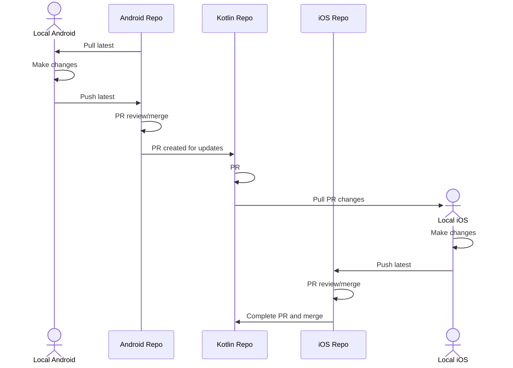

# KMMBridge With SKIE

This is a template project for Kotlin Multiplatform using KMMBridge to publish Xcode Framework binaries and incorporating SKIE to help streamline the API design for calling from Swift.

You can use the template as a great starting point for including shared Kotlin in your native mobile project.

## [KMMBridge Quick Start Blog Post](https://touchlab.co/kmmbridge-quick-start)

Read more about this repo, what you can use it for, and how to get started.

## [Template Docs](https://touchlab.co/kmmbridgeskie)

Detailed docs about this repo project.

# Hello

